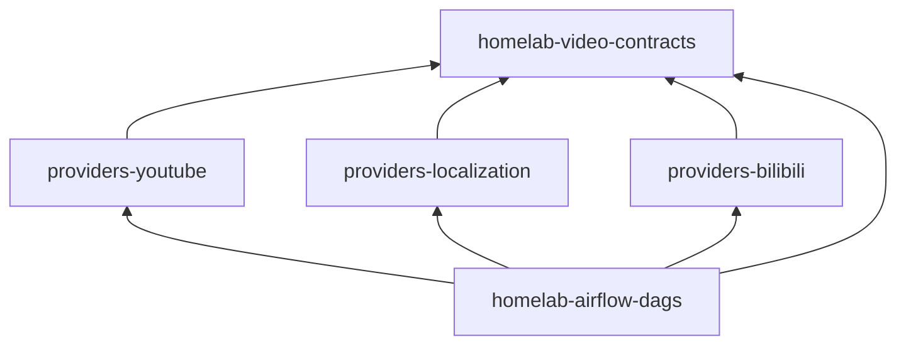
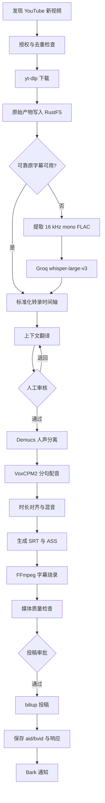

# YouTube 视频本地化与 Bilibili 投稿开发计划

## 1. 文档状态

| 项目 | 内容 |
| --- | --- |
| 状态 | Draft |
| 目标版本 | MVP |
| Python | `>=3.12,<3.13` |
| Airflow | `2.11.0` |
| 对象存储 | RustFS（S3-compatible API） |
| ASR | Groq `whisper-large-v3` |
| 翻译 | OpenAI-compatible Chat Completions |
| TTS | VoxCPM2 服务 |
| Bilibili 投稿 | `biliup==1.2.2` Python SDK（Provider 适配层） |

本文档定义从 YouTube 发现视频、下载、本地化处理到 Bilibili 投稿的目标架构、Provider 边界、数据契约和分阶段交付计划。

## 2. 目标与非目标

### 2.1 目标

- 定时发现指定 YouTube 频道的新视频。
- 下载原视频、元数据和可用的原始字幕。
- 使用外部 ASR 生成带词级时间戳的英文转录。
- 从同一份翻译时间轴生成中文字幕和中文配音。
- 分离人声与背景音，完成中文配音、时长对齐和混音。
- 生成 SRT、ASS 和烧录字幕的最终视频。
- 使用 `biliup` 将审核通过的成片投稿到 Bilibili。
- 使用 RustFS 保存原始文件、中间产物、成片和第三方原始响应。
- 支持阶段级重试、幂等执行、人工审核和失败后续跑。

### 2.2 非目标

- 不在 Airflow scheduler、webserver 或普通 worker 中安装 PyTorch、CUDA、Demucs、Whisper 或 VoxCPM2。
- 不自行实现 YouTube 下载协议或 Bilibili 投稿协议。
- 不将音视频、字幕全文或第三方完整响应写入 XCom。
- 不把 RustFS、Groq、翻译服务或 VoxCPM2 的密钥写入 DAG 参数。
- MVP 不支持多说话人角色配音、口型同步和实时流处理。
- MVP 不以无人审核的全自动公开投稿为默认模式。

## 3. 核心架构决策

### 3.1 Provider 按外部系统拆分

Provider 只封装外部系统的认证、协议和稳定 Airflow 接口。媒体领域模型放入独立 contracts 包，业务编排只存在于 DAG 中。

```text
packages/
├── homelab-airflow-dags
├── homelab-airflow-bark
├── homelab-airflow-providers-youtube
├── homelab-airflow-providers-localization
├── homelab-airflow-providers-bilibili
└── homelab-video-contracts
```



禁止 Provider 互相依赖。DAG 是唯一负责串联 YouTube、Localization 和 Bilibili Provider 的组件。

### 3.2 RustFS 复用 Amazon Provider

RustFS 提供 S3-compatible API，因此继续使用 `apache-airflow-providers-amazon` 的 `S3Hook`，不创建 RustFS Provider。

- Airflow Connection ID：`rustfs_default`。
- 所有产物使用标准 `s3://` URI。
- 禁止在领域模型中出现 `rustfs://` 或 `minio://` URI。
- 第一阶段不依赖 RustFS 生命周期规则，由 cleanup DAG 显式清理临时产物。

### 3.3 外部 AI 服务与 K8s 本地媒体处理

Airflow Provider 不承载模型推理。Localization Gateway 是轻量控制面，负责幂等、厂商 adapter、状态归一化和产物登记。ASR、翻译、TTS 和可选人声分离使用外部服务；音频预处理、混音、字幕生成和最终 FFmpeg 渲染运行在独立 K8s CPU Job 中，不占用 Airflow worker。Provider 仅提交任务、查询状态、取消任务并返回标准结果。

### 3.4 单一翻译时间轴

字幕和配音必须共享同一份 `TranslatedTimeline`，不得分别调用翻译模型。它是 SRT、ASS、TTS 输入、审核数据和翻译缓存的唯一来源。

## 4. 总体流程



## 5. Airflow 2.11 Provider 实现基线

本仓库运行时固定为 Apache Airflow `2.11.0`。当前环境包含 HTTP Provider `5.3.2` 和 Amazon Provider `9.34.0`。开发必须使用 Airflow 2.11 的导入路径、discovery 和 Dataset API，不提前使用 Airflow 3 Task SDK。

### 5.1 官方 Provider 结构结论

Airflow 2.11 的 HTTP Provider 运行时布局如下，三个自研 Provider 应遵循同一分层：

```text
homelab-airflow-providers-<name>/
├── CHANGELOG.md
├── README.md
├── pyproject.toml
├── src/homelab_airflow_providers_<name>/
│   ├── __init__.py
│   ├── get_provider_info.py
│   ├── py.typed
│   ├── hooks/<name>.py
│   ├── operators/<name>.py
│   ├── sensors/<name>.py
│   └── triggers/<name>.py       # 仅异步等待型 Provider
└── tests/
    ├── test_provider_info.py
    ├── test_hooks.py
    ├── test_operators.py
    ├── test_sensors.py
    └── test_triggers.py
```

官方 Provider 源码使用 `provider.yaml` 生成 `get_provider_info.py`，wheel 运行时通过后者 discovery。本仓库暂不引入官方生成器，直接维护 `get_provider_info.py`，避免两个事实来源。

### 5.2 包元数据与 entry point

Provider 声明最低兼容范围，应用包负责精确锁定 Airflow：

```toml
[project]
requires-python = '>=3.12,<3.13'
dependencies = [
    'apache-airflow>=2.11.0,<3.0',
    'homelab-video-contracts>=0.1.0,<0.2.0',
]

[project.entry-points.'apache_airflow_provider']
provider_info = 'homelab_airflow_providers_localization.get_provider_info:get_provider_info'

[tool.hatch.build.targets.wheel]
packages = ['src/homelab_airflow_providers_localization']
```

YouTube 和 Bilibili 包使用各自模块路径。每个 distribution 只注册自己的 entry point。

`get_provider_info()` 必须返回 `package-name`、`name`、`description`、`hooks`、`operators` 和 `connection-types`；Localization 还需声明 `triggers`。`connection-types` 中的 `connection-type` 与 Hook 的 `conn_type` 必须一致，`hook-class-name` 使用完整可导入路径。Airflow 2.11 不需要已废弃的 `hook-class-names`。metadata 函数不得读取 Secret、创建 Hook 或导入重量级 SDK。

### 5.3 Airflow 2.11 导入约定

```python
from airflow.configuration import conf
from airflow.datasets import Dataset
from airflow.hooks.base import BaseHook
from airflow.models import BaseOperator
from airflow.sensors.base import BaseSensorOperator
from airflow.triggers.base import BaseTrigger, TriggerEvent
from airflow.utils.context import Context
```

禁止使用 `from airflow.sdk import Asset, BaseOperator`。`airflow.sdk` 属于 Airflow 3，在本仓库环境中不可导入；升级时另建兼容迁移。

### 5.4 流程步骤与 Hook/Connection 决策

只有跨进程访问外部系统且需要统一认证、重试或错误映射的步骤才封装 Hook。纯媒体算法不创建 Airflow Connection。

| 流程步骤 | Hook | Connection | 决策 |
| --- | --- | --- | --- |
| YouTube 频道发现、元数据 | `YouTubeHook` | `youtube_default` | 自定义，API key 与 Data API 配置 |
| YouTube 视频下载 | `LocalizationHook` 的 ingest/download 能力 | `localization_default` | `yt-dlp`、Cookie、代理和 PO Token 放服务内部 |
| RustFS 读写 | 官方 `S3Hook` | `rustfs_default`（`aws` 类型） | 复用 Amazon Provider |
| ASR、翻译、TTS、渲染任务 | `LocalizationHook` | `localization_default` | 自定义，隐藏 Groq/LLM/VoxCPM2 内部凭证 |
| 等待本地化任务 | `LocalizationAsyncHook` 或异步 client | 同上 | 供 Trigger 使用，只查询状态 |
| FFmpeg、Demucs、字幕生成 | 无 | 无 | Localization worker 内部计算 |
| Bilibili 登录、续期、投稿 | `BilibiliHook` | `bilibili_default` | 自定义，凭证文件由 Secret 挂载 |
| Bark 通知 | 现有 Bark client/operator | 现有 Bark 配置 | 保持现状 |

最终只新增三个自定义 Connection type：`youtube`、`localization`、`bilibili`。RustFS 使用已有 `aws` type；Groq、翻译服务和 VoxCPM2 不直接暴露给 DAG，因此不分别创建 Airflow Connection。

### 5.5 Hook、Operator 与 Trigger 约束

- Hook 定义 `conn_name_attr`、`default_conn_name`、`conn_type` 和 `hook_name`。
- Hook 首次调用时构建 client，并提供无副作用的 `test_connection() -> tuple[bool, str]`。
- Operator 构造函数只保存参数，不访问 Connection、RustFS 或外部 API。
- `execute()` 只返回可序列化小模型或产物 URI，不返回 HTTP Response、音视频或字幕全文。
- URI、video ID 可加入 `template_fields`；token、Cookie 和 headers 不模板化。
- YouTube 轮询使用 `BaseSensorOperator(mode='reschedule')`。
- Localization job 等待时间长，MVP 实现 deferrable Operator 和 `LocalizationJobTrigger`，并保留同步路径。
- Trigger 只传可序列化的 `conn_id`、`job_id`、poll interval 和 timeout，并使用异步 HTTP client。
- Trigger 只能查询状态，不得创建任务、写 RustFS 或发布稿件。

本流程需要先在 worker 中提交 job，再进入 triggerer，因此不使用 `start_from_trigger`；Operator 在 `execute()` 中创建 job 后调用 `self.defer()`。

### 5.6 Dataset 与 discovery 兼容策略

- Airflow 2.11 使用 `airflow.datasets.Dataset`，不使用 Airflow 3 的 `airflow.sdk.Asset`。
- 使用 `inlets`、`outlets` 和 `outlet_events`，对外函数命名为 `*_dataset()`。
- Dataset URI 和 extra 明文保存在元数据库中，不得包含凭证、presigned URL 或完整字幕。
- 每个 Provider 测试 entry point、`provider_info.schema.json`、Hook 类路径和 `ProvidersManager` discovery。
- `airflow providers list/get/hooks` 必须在 Linux 容器或 CI 中验证，不能以 Windows 原生 CLI 为验收环境。

## 6. Provider 设计

### 6.1 YouTube Provider

包名：`homelab-airflow-providers-youtube`

职责：通过 Data API/RSS 发现视频、获取元数据并提供 Operator/Sensor/Dataset。它不负责下载、ASR、翻译、渲染、投稿和业务游标持久化。

```text
Connection ID: youtube_default
Connection type: youtube
Password: YouTube Data API Key
Extra:
  api_base_url: https://www.googleapis.com/youtube/v3
  timeout: 30
  proxy: optional
```

下载 Cookie、代理和 PO Token provider 配置属于 Localization Service Secret，不进入 Data API Connection。

```python
class YouTubeHook(BaseHook):
    def get_channel(self, channel_id: str) -> YouTubeChannel: ...
    def list_channel_videos(self, channel_id: str, ...) -> list[YouTubeVideo]: ...
    def get_videos(self, video_ids: Sequence[str]) -> list[YouTubeVideo]: ...
```

```text
YouTubeChannelVideosOperator
YouTubeChannelVideoSensor
```

Dataset URI：

```text
youtube://channel/{channel_id}/uploads
youtube://video/{video_id}
```

### 6.2 Localization Provider

包名：`homelab-airflow-providers-localization`

职责：调用 Localization Service 创建、查询、等待和取消阶段任务，将响应转换为 `homelab-video-contracts` 模型。

```text
Connection ID: localization_default
Connection type: localization
Host: https://localization.internal.example.com
Password: Service API token
Extra:
  timeout: 30
  poll_interval: 15
  verify_tls: true
```

Groq、翻译模型和 VoxCPM2 密钥由 Localization Service 管理，不进入 Airflow Connection。

```python
class LocalizationHook(BaseHook):
    def submit_job(self, request: LocalizationJobRequest) -> LocalizationJob: ...
    def get_job(self, job_id: str) -> LocalizationJob: ...
    def wait_for_job(self, job_id: str, ...) -> LocalizationJob: ...
    def cancel_job(self, job_id: str) -> LocalizationJob: ...
```

```text
VideoDownloadOperator
AudioTranscriptionOperator
SubtitleTranslationOperator
SourceSeparationOperator
SpeechSynthesisOperator
VideoRenderOperator
LocalizationJobTrigger
```

MVP 实现 deferrable Operator/Trigger，并保留 `deferrable=False` 的同步轮询路径。

```text
POST /v1/jobs
GET  /v1/jobs/{job_id}
POST /v1/jobs/{job_id}/cancel
```

请求和响应只包含 S3 URI、配置、任务 ID 和精简状态，不传 base64 音视频。

### 6.3 Bilibili Provider

包名：`homelab-airflow-providers-bilibili`

职责：通过固定版本的 `biliup==1.2.2` Python SDK 适配层检查登录、上传封面、投稿、完整稿件编辑追加分 P、归档查询和状态标准化。上传/追加输入可为本地路径或 RustFS `Artifact`，后者统一经 Amazon `S3Hook` 下载并校验。

```text
Connection ID: bilibili_default
Connection type: bilibili
Extra:
  credential_secret_path: /var/run/secrets/bilibili/cookies.json
  sdk: biliup-python
  uploader_version: pinned
  line: auto
```

Cookie 和 token 必须从 Secret 或只读凭证卷读取，不写入 Connection Extra、XCom 或普通日志。

```python
class BilibiliHook(BaseHook):
    def check_login(self) -> BilibiliLoginStatus: ...
    def renew_credentials(self) -> BilibiliLoginStatus: ...
    def upload(self, request: BilibiliUploadRequest) -> BilibiliUploadResult: ...
    def append(self, archive: BilibiliArchiveSnapshot, request: BilibiliAppendRequest) -> BilibiliUploadResult: ...
    def get_archive(self, aid: int) -> BilibiliArchiveSnapshot: ...
```

```text
BilibiliPublicationSensor
BilibiliArchiveLookupOperator
BilibiliUploadOperator
BilibiliAppendOperator
```

Dataset URI：`bilibili://video/{bvid}`。

## 7. 共享数据契约

包名：`homelab-video-contracts`。该包不得依赖 Airflow、boto3、HTTP client 或推理库，持久化模型必须包含 `schema_version`。

```text
src/homelab_video_contracts/
├── artifacts.py
├── youtube.py
├── transcript.py
├── translation.py
├── synthesis.py
├── rendering.py
├── bilibili.py
└── manifest.py
```

```python
class Artifact:
    uri: str
    content_type: str
    size: int | None
    etag: str | None
    version_id: str | None
    sha256: str | None

class TranscriptWord:
    start_ms: int
    end_ms: int
    text: str
    probability: float | None

class TranscriptSegment:
    segment_id: str
    start_ms: int
    end_ms: int
    text: str
    words: list[TranscriptWord]

class TranslatedSegment:
    segment_id: str
    source_start_ms: int
    source_end_ms: int
    source_text: str
    translated_text: str
    speaker: str | None
    translation_version: int
```

`segment_id` 在 ASR、翻译、TTS、字幕和审核流程中保持稳定。

## 8. RustFS 产物布局

```text
s3://video-localization/youtube/{video_id}/
├── manifest.json
├── source/
│   ├── video.mp4
│   ├── metadata.json
│   └── original.en.vtt
├── audio/
│   ├── speech.flac
│   ├── vocals.wav
│   └── accompaniment.wav
├── asr/
│   ├── chunks/
│   ├── raw/
│   └── transcript.json
├── translation/
│   ├── timeline.zh-CN.json
│   ├── subtitle.zh-CN.srt
│   └── subtitle.zh-CN.ass
├── tts/
│   ├── segments/
│   └── dubbed.zh-CN.wav
├── render/
│   └── final.zh-CN.mp4
└── publish/
    └── bilibili.json
```

```yaml
endpoint_url: https://rustfs.example.com
region_name: us-east-1
config_kwargs:
  s3:
    addressing_style: path
```

存储规则：

- 启用 bucket versioning。
- 每个产物记录 ETag、Version ID、SHA-256、大小和 Content-Type。
- `manifest.json` 是产物索引，不是任务锁。
- 大文件必须验证 multipart 上传、下载和失败恢复。
- cleanup DAG 只能删除过期且不被成功发布记录引用的临时产物。

## 9. 外部 ASR 设计

```text
Endpoint: /openai/v1/audio/transcriptions
Model: whisper-large-v3
Response format: verbose_json
Timestamp granularities: segment, word
Language: en
Temperature: 0
```

```bash
ffmpeg -i input.mp4 -vn -ar 16000 -ac 1 -c:a flac speech.flac
```

预处理不得改变音频时间轴。长音频默认按 10 至 15 分钟切片，相邻切片重叠 1 至 2 秒；每片记录绝对 `offset_ms`，原始响应写入 RustFS，成功切片可独立复用。

Localization Service 通过 multipart 上传音频到 Groq。默认不向公网暴露 RustFS，也不把 presigned URL 写入日志。

## 10. 翻译、配音和字幕规则

### 10.1 翻译

- 先构建全文上下文、术语表、人名表和标题摘要。
- 按上下文块翻译，不进行完全无上下文的逐句翻译。
- 输出保留稳定 `segment_id`。
- 译文应考虑原时间窗，过长时优先压缩表达。
- 每次人工修改递增 `translation_version`。

### 10.2 配音

- 每个翻译段独立生成，支持局部重试和重生成。
- VoxCPM2 reference audio 必须来自已授权素材。
- 检查生成音频的静音、峰值、响度、时长和空文件。
- 轻微时长差异使用 tempo 调整；差异过大时重新压缩译文并生成。

### 10.3 字幕与渲染

- SRT 用于交付和排查，ASS 用于最终烧录。
- 横屏与竖屏分别定义 style profile。
- FFmpeg 镜像必须包含 libass、fontconfig 和指定中文字体。
- 最终渲染阶段只进行一次必要的视频重编码。

## 11. 幂等、重试和状态

```text
download: youtube:{video_id}:{format_profile_version}
asr: {audio_sha256}:{provider}:{model}:{config_version}
translate: {transcript_sha256}:{target_language}:{prompt_version}
tts: {translated_segment_sha256}:{voice_profile_version}
render: {source_sha256}:{timeline_sha256}:{audio_sha256}:{profile_version}
upload: bilibili:{source_video_id}:{render_sha256}:{account_id}
```

| 类型 | 示例 | 策略 |
| --- | --- | --- |
| Transient | 网络错误、429、5xx | 指数退避重试 |
| Authentication | Cookie/API key 失效 | 停止自动重试并通知 |
| Input | 视频不可用、音轨缺失 | 标记不可重试 |
| Quality | ASR 为空、TTS 超时长、渲染异常 | 人工审核或局部重跑 |
| Policy | 无授权、投稿审批未通过 | 阻止后续阶段 |

Airflow 保存编排状态；Localization Service 保存 job 状态；RustFS 保存不可变产物、原始响应和 manifest；业务数据库保存 YouTube video ID 到 Bilibili aid/bvid 的映射和审核状态。

## 12. 安全与合规

- 只处理明确拥有下载、翻译、配音和再发布授权的视频。
- 投稿前保留 rights check 和 publish approval。
- 声音克隆需获得权利人授权并记录 voice profile 授权信息。
- 所有凭证通过 Secret 管理。
- 日志必须脱敏 Authorization、Cookie、token、presigned URL 和完整 Connection 信息。
- 外部 ASR 与翻译服务的数据留存策略必须在启用前完成评估。
- `biliup` README 包含禁止商业用途的声明；商业场景启用前必须确认授权和平台条款。

## 13. 测试策略

- Contracts：JSON round-trip、schema version、时间范围、segment ID、S3 URI 和校验和。
- Provider：mock 所有 HTTP/CLI、Provider discovery、Connection schema、日志脱敏和错误映射。
- RustFS：put/get/head/copy/delete、versioning、presigned URL 和 multipart。
- Groq：短音频、长音频切片、词级时间戳、429 和超时。
- Localization：失败续跑、幂等复用、局部重新翻译和重新配音。
- biliup：登录检查、测试账号投稿和凭证失效。
- Airflow：DAG import、动态任务映射、Sensor reschedule、deferrable Trigger 和 Dataset Event。
- 媒体：音视频流、总时长、黑屏、响度、字幕字体和安全区域。

## 14. 分阶段交付计划

### Phase 0：Contracts 与基础设施

- [x] 创建 homelab-video-contracts。
- 配置 `rustfs_default` 和测试 bucket。
- [x] 定义版本化 Manifest、Artifact、Job、时间轴、TTS、渲染和发布结果模型。
- 完成 RustFS S3 兼容性冒烟测试。

验收：contracts 测试通过；`S3Hook` 可完成基础和 multipart 操作。

### Phase 1：YouTube 发现与下载

- [x] 完成 Provider discovery、Hook、Operator、Sensor 和 Dataset Event。
- [x] 实现 Localization Service 下载契约和 `VideoDownloadOperator`。
- 保存视频、元数据、缩略图和原字幕到 RustFS。

验收：给定频道 ID 能发现新视频并幂等入库，不泄露凭证。

### Phase 2：外部 ASR 与翻译

- [x] 创建 Localization Provider，并接入共享 Job contract。
- 实现 Groq ASR、长音频切片和时间轴合并。
- 实现 Transcript、上下文翻译和 TranslatedTimeline。
- 生成 SRT/ASS 预览。

验收：真实英文视频产生稳定词级时间轴；局部失败可续跑；结果可审核。

### Phase 3：配音与渲染

- 接入外部 TTS 和可选的外部人声分离服务。
- 实现分句 TTS、时长对齐，并通过 K8s CPU Job 完成本地 FFmpeg 混音和字幕烧录。
- 实现媒体质量检查。

验收：产出可播放的中文配音和烧录字幕版本；修改单句只重跑受影响阶段。

### Phase 4：Bilibili 投稿

- 完成 Bilibili Provider discovery。
- 固定并封装 `biliup==1.2.2` Python SDK。
- 实现登录检查、投稿、归档查询、审核/发布状态 Sensor 和完整追加。
- 接入 RustFS Artifact staging、publication record 幂等键和 reconcile 边界。
- 保存 aid、bvid、投稿响应和映射，接入 Bark 通知。

验收：成片可幂等投稿；凭证失效不会无限重试；重复 DAG run 不重复投稿。

### Phase 5：运行加固

- 加固 deferrable job、增加 cleanup DAG、指标、fallback 和人工重跑入口。
- 完成灾难恢复和凭证轮换演练。

## 15. MVP DAG 草图

```python
videos = YouTubeChannelVideosOperator(...)

downloads = VideoDownloadOperator.partial(
    localization_conn_id='localization_default',
    storage_conn_id='rustfs_default',
).expand(video=videos.output)

transcripts = AudioTranscriptionOperator.partial(
    localization_conn_id='localization_default',
).expand(source=downloads.output)

translations = SubtitleTranslationOperator.partial(
    localization_conn_id='localization_default',
).expand(transcript=transcripts.output)

speech = VoiceSynthesisOperator.partial(
    localization_conn_id='localization_default',
).expand(timeline=translations.output)

renders = VideoRenderOperator.partial(
    localization_conn_id='localization_default',
).expand(source=downloads.output, timeline=translations.output, speech=speech.output)

checked = MediaQualityCheckOperator.partial(
    localization_conn_id='localization_default',
).expand(video=renders.output)

uploads = BilibiliUploadOperator.partial(
    bilibili_conn_id='bilibili_default',
).expand(video=checked.output)
```

实际实现必须在翻译后和投稿前增加审核门禁；以上代码仅表达 Operator 依赖关系。

## 16. 开发完成定义

- Provider 能被 `airflow providers list` 正确发现。
- Provider metadata 通过 Airflow 2.11 `provider_info.schema.json` 校验。
- Connection、Hook、Operator 和模型有类型标注及 Google-style docstring。
- Provider 单元测试不访问真实外部服务。
- DAG import sweep、Ruff、pre-commit、pytest 和文档构建通过。
- 日志脱敏覆盖 API key、Cookie、token 和 presigned URL。
- 每个阶段有稳定幂等键、产物校验和失败分类。
- 真实样本完成一次从 YouTube 到 Bilibili 的人工审核端到端演练。

## 17. 上游项目与文档

- [YouDub-webui](https://github.com/liuzhao1225/YouDub-webui)：端到端本地化流程和效果基线。
- [biliup](https://github.com/biliup/biliup)：Bilibili 登录与投稿执行器。
- [yt-dlp](https://github.com/yt-dlp/yt-dlp)：YouTube 下载执行器。
- [Groq Speech-to-Text](https://console.groq.com/docs/speech-to-text)：外部 Whisper Large V3 服务。
- [VoxCPM2](https://github.com/OpenBMB/VoxCPM)：中文及跨语言声音克隆 TTS。
- [FFmpeg subtitles filter](https://ffmpeg.org/ffmpeg-filters.html#subtitles-1)：基于 libass 的字幕烧录。
- [RustFS](https://github.com/rustfs/rustfs)：S3-compatible 对象存储。
- [Airflow custom providers](https://airflow.apache.org/docs/apache-airflow-providers/howto/create-custom-providers.html)：entry point 和 metadata 规范。
- [Airflow 2.11 deferrable operators](https://airflow.apache.org/docs/apache-airflow/2.11.0/authoring-and-scheduling/deferring.html)：Operator/Trigger 生命周期。
- [Airflow 2.11 data-aware scheduling](https://airflow.apache.org/docs/apache-airflow/2.11.0/authoring-and-scheduling/datasets.html)：Dataset、事件元数据和安全约束。
